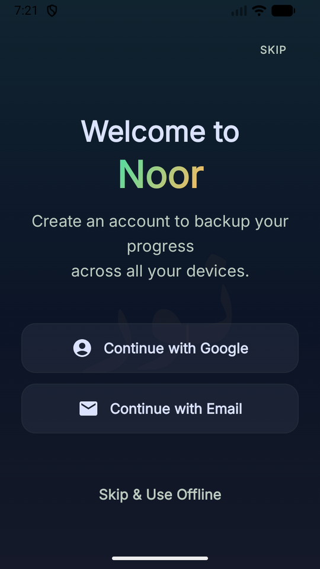
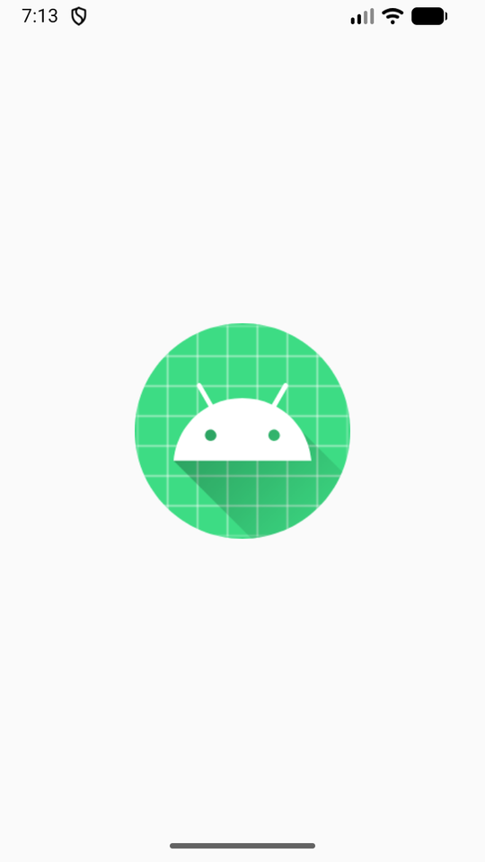
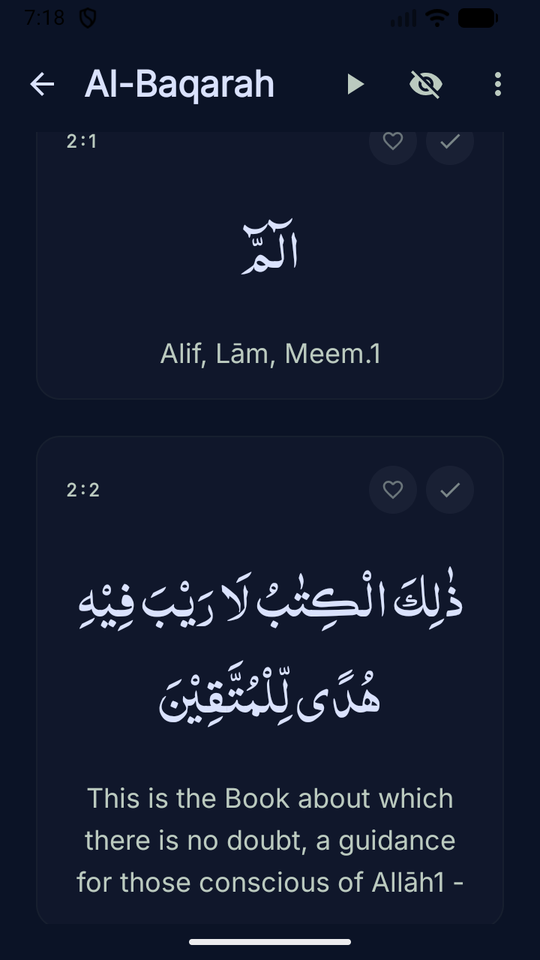
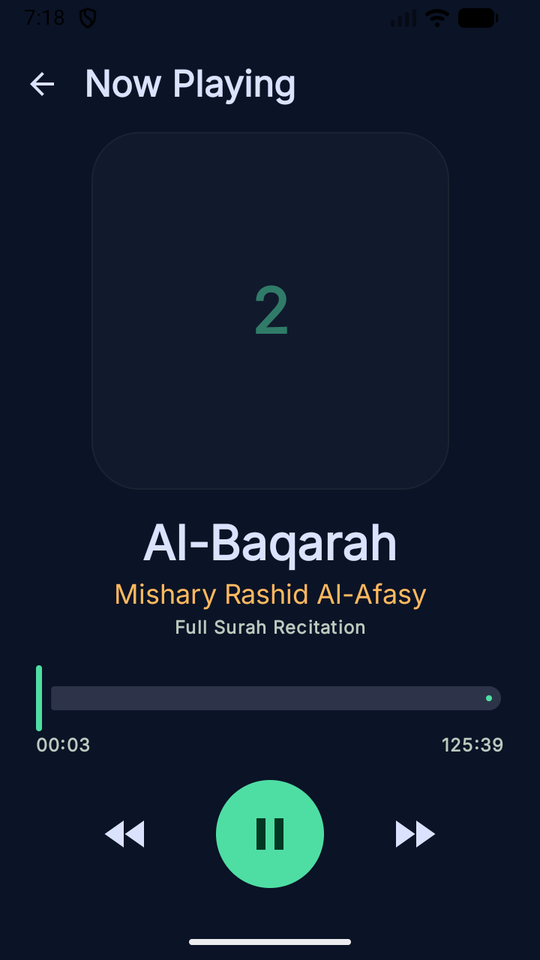
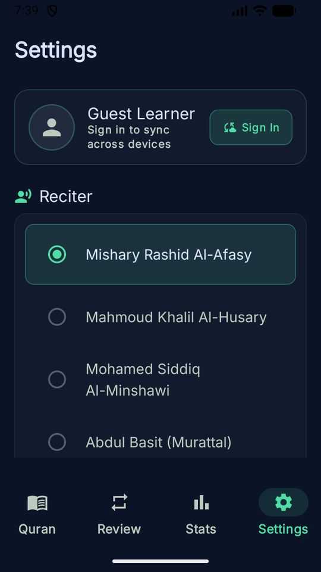

# Noor — Quran Learner

A cross-platform Quran learning app built with Kotlin Multiplatform and Compose Multiplatform. Available on **Android, iOS, Desktop, and Web**.

Noor combines traditional Quran study tools with **science-backed learning techniques** — spaced repetition, active recall, interleaved practice, and micro-learning — to help you memorize and retain the Quran effectively.

## Screenshots

| Onboarding | Script Selection | Surah List |
|------------|------------------|------------|
|  |  |  |

| Reader (Indo-Pak) | Surah Player | Settings |
|-------------------|--------------|----------|
|  |  |  |

---

## Features

### 📖 Reading & Discovery

- **Full Quran Text** — All 114 surahs with verse-level Arabic text and English translations
- **Dual Script Support** — Switch between **Uthmani** (Madinah Mushaf) and **Indo-Pak** (Nastaleeq) scripts
- **Surah Overview** — Progress circles, Arabic & English names, ayah counts, revelation type
- **Search** — Find surahs by name, translation, or number
- **Pin Surahs** — Pin frequently accessed surahs to the top of your list
- **Focus Mode** — Distraction-free reading that hides all chrome

### 🎧 Audio & Recitation

- **8 Renowned Reciters** — Al-Afasy, Al-Husary, Al-Minshawi, Abdul Basit, As-Sudais, Ash-Shuraim, Al-Ajamy, Al-Muaiqly
- **Ayah-by-Ayah Playback** — Stream individual ayah audio from `everyayah.com`
- **Full Surah Player** — Stream complete surahs with seek controls, 15s skip, progress slider
- **Docked Bottom Player** — Animated squiggly progress bar, play/pause, prev/next, loop, time display
- **Auto-Advance** — Continuous playback moves to the next ayah automatically
- **Data Saver Mode** — Switch from 128kbps to 64kbps to save bandwidth
- **Offline Downloads** — Download surahs for offline listening (Android: ExoPlayer-based caching engine)

### 🧠 Spaced Repetition System (SM-2)

Noor uses a modified **SuperMemo SM-2 algorithm** to schedule ayah reviews at optimal intervals:

| Rating | Description | Effect |
|--------|-------------|--------|
| **Forgot** | Couldn't recall | Resets to 1 day, re-queues for same-day retry |
| **Hard** | Recalled with effort | Partial interval adjustment |
| **Easy** | Recalled immediately | Interval grows faster |

- **Interleaved Practice** — Reviews mix ayahs from different surahs, forcing stronger recall
- **Active Recall** — Retrieval practice through structured review sessions
- **Session Limit** — 50 reviews per session, ordered by due date (oldest first)
- **Progress Tracking** — Each ayah marked as learned earns 10 XP and initializes SRS scheduling

### 🎮 Gamification & Achievements

**XP & Leveling** — Earn XP for learning ayahs (+10 each). Level = `(XP / 100) + 1`.

| Achievement | Reward | Trigger |
|-------------|--------|---------|
| First Seed | 10 XP | Learn your first ayah |
| The Opening | 100 XP | Complete Surah Al-Fatiha |
| Throne Verse | 50 XP | Learn Ayatul Kursi (2:255) |
| The Protectors | 200 XP | Complete Surahs 112, 113, 114 |
| The Cave | 150 XP | Complete Surah Al-Kahf |
| The Merciful | 150 XP | Complete Surah Ar-Rahman |
| The Heart | 300 XP | Complete Surah Yaseen |
| The Defender | 250 XP | Complete Surah Al-Mulk |
| On Fire | 100 XP | 7-day learning streak |
| Habit Builder | 500 XP | 30-day streak |
| Iron Will | 2,000 XP | 100-day streak |
| Early Bird | 150 XP | Learn between 4-6 AM |
| Friday Habit | 100 XP | Read Al-Kahf on Friday |
| Marathon Learner | 200 XP | 50 ayahs in one day |
| Juz Amma Master | 1,000 XP | Complete Juz 30 (Suras 78–114) |
| Halfway There | 5,000 XP | 50% of the entire Quran |
| Khatam Al-Quran | 10,000 XP | Complete all 6,236 ayahs |

### ⏰ Streaks & Daily Goals

- **Streak Tracking** — Consecutive day counter with motivational milestones
- **Daily Goal** — Configurable target (1–30 ayahs/day), visualized with a progress bar
- **Activity Heatmap** — Last 7 days overview on the Stats screen

### 🔔 Reminders

- **Daily Push Notifications** — Custom time picker with presets (6 AM, 12 PM, 6 PM, 8 PM, 10 PM)
- **Cross-Platform** — AlarmManager on Android, UNUserNotificationCenter on iOS

### 🔖 Bookmarks & Favorites

- **Favorite Ayahs** — Heart toggle on any ayah
- **Favorites Filter** — Toggle between "All Surahs" and "Favorites" on the home screen

### 🎨 Personalization

- **Arabic Font Size** — 24–56sp slider
- **Translation Font Size** — 12–28sp slider
- **Translation Toggle** — Show/hide English translation
- **Script Toggle** — Uthmani / Indo-Pak

### 📊 Stats & Profile

- **Level & XP** — Current level with XP progress to next
- **Achievement Grid** — All 17 achievements (locked/unlocked) in a 2-column grid
- **Learning Progress** — Per-surah progress circles on the home screen

---

## Science-Backed Learning Techniques

| Technique | How Noor Implements It |
|-----------|----------------------|
| **Spaced Repetition** | SM-2 algorithm schedules reviews at increasing intervals based on your recall accuracy |
| **Active Recall** | Review sessions require you to retrieve ayahs from memory before rating yourself |
| **Interleaved Practice** | Reviews mix ayahs from different surahs, not blocked by surah |
| **Feedback Loops** | Forgot/Hard/Easy ratings adjust future intervals in real time |
| **Micro-Learning** | Learn one ayah at a time — small, achievable increments |
| **Goal Setting** | Self-determined daily targets with clear progress visualization |
| **Streak Motivation** | Consecutive day tracking builds habit formation through loss aversion |

---

## Tech Stack

| Layer | Technology |
|-------|-----------|
| Language | Kotlin (Multiplatform) |
| UI | Compose Multiplatform + Material3 |
| Architecture | MVVM (ViewModels + StateFlow) |
| Database | Androidx SQLite (BundledSQLiteDriver) |
| Audio (Android) | ExoPlayer (Media3) with 100MB LRU cache |
| Audio (iOS) | AVPlayer |
| Navigation | Navigation Compose KMP (type-safe routes via Kotlin Serialization) |
| Networking | Ktor Client |
| Serialization | Kotlinx Serialization |
| Date/Time | Kotlinx Datetime |
| Image Loading | Coil (3.x) |
| DI | CompositionLocal + manual factories (no framework) |

### Platforms

- **Android** — `minSdk 24`, `targetSdk 36`, `compileSdk 36`
- **iOS** — via Kotlin/Native + Compose Multiplatform
- **Desktop** — JVM (`.dmg`, `.msi`, `.deb`)
- **Web** — Kotlin/Wasm + Kotlin/JS

---

## Build & Run

```bash
# Android (debug)
./gradlew :composeApp:assembleDebug

# Web (Wasm)
./gradlew :composeApp:wasmJsBrowserDevelopmentRun

# Web (JS)
./gradlew :composeApp:jsBrowserDevelopmentRun

# Desktop
./gradlew :composeApp:run

# iOS
# Open iosApp/ in Xcode and run from there
```

---

## License

Free, open-source, ad-free, and privacy-respecting. Data is stored locally — no third-party tracking.
